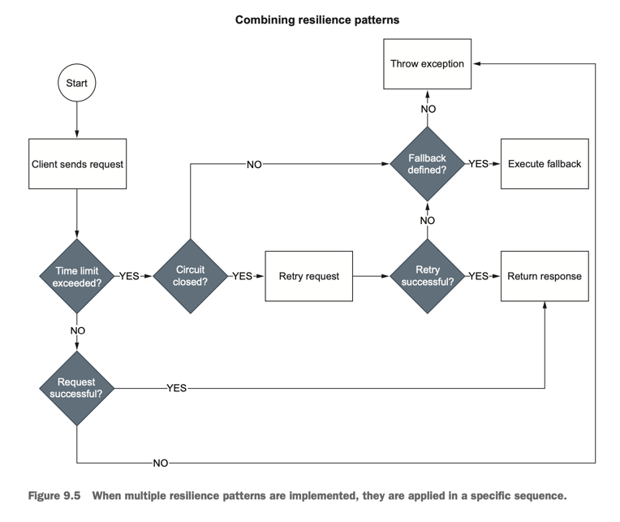

# Notes for Edge Service

#### BOOTING UP THIS PROJECT
First, we need both Catalog Service and Order Service 
up and running. From each project’s root folder, 
run `./gradlew bootBuildImage` to package them as container images. 
Then start them via Docker Compose. 
Open a Terminal window, navigate to the folder where your 
`docker-compose.yml` file is located `(polar-deployment/docker)`, 
and run the following command:
```bash
docker-compose up -d catalog-service order-service
```

Start the redis container:
```bash
docker-compose up -d polar-redis
```

Since both applications depend on PostgreSQL, Docker Compose 
will also run the PostgreSQL container.
When the downstream services are all up and running, 
it’s time to start Edge Service. 
From a Terminal window, navigate to the project’s root folder 
`(edge-service)`, and run the following command:
```bash
./gradlew bootRun
```
Terminate all the containers by giving the path to 
`docker-compose.yml` file:
```bash
docker-compose -f <path_to_docker-compose.yml> down
```

<br>

---

## Circuit breakers for Spring with resilience4j
There is **closed**, **open** and **half-open** states when talking
about circuit breakers.
**Closed** state allows normal operation, and requests are allowed
to pass through.
In the **open** state, the circuit breaker stops requests from being 
passed through, providing a kind of "short-circuit" behavior.
The **half-open** state is an intermediary state between open and closed.
After a certain time period in the open state, the circuit breaker 
transitions to the **half-open** state. 
In this state, a limited number of requests are allowed to 
pass through.

When you combine multiple resilience patterns, 
the sequence in which they are applied is fundamental. 
Spring Cloud Gateway takes care of applying the TimeLimiter 
first (or the timeout on the HTTP client), 
then the CircuitBreaker filter, and finally Retry. 
Figure 9.5 shows how these patterns work together to increase 
the application’s resilience.

The result can be verified by using the tool `Apache Benchmark`.


## Request rate limiter
The implementation of RequestRateLimiter on Redis is based 
on the token bucket algorithm. 
Each user is assigned a bucket inside which tokens are dripped 
over time at a specific rate (the replenish rate). 
Each bucket has a maximum capacity (the burst capacity). 
When a user makes a request, a token is removed from its bucket. 
When there are no more tokens left, the request is not permitted, 
and the user will have to wait until more tokens have dripped 
into its bucket.
To know more about the token bucket algorithm, 
recommend reading Paul Tarjan’s “Scaling your API with 
Rate Limiters” article about how they use it to implement rate 
limiters at Stripe 
[rate-limiters](https://stripe.com/blog/rate-limiters).

## Redis
What happens if Redis becomes unavailable? 
Spring Cloud Gateway has been built with resilience in mind, 
so it will keep its service level, but the rate limiters 
would be disabled until Redis is up and running again.